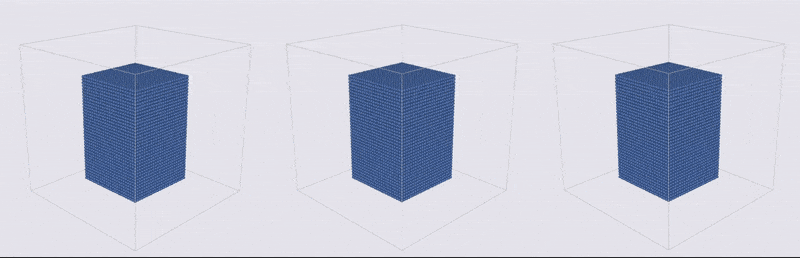

# C++ Fluid Particles

This repository contains my own implementation of several Smoothed Particle Hydrodynamics (SPH) related papers using C++ and CUDA, including the Weakly Compressible SPH [1], Position-Based Fluids [2], Divergence-Free SPH [3], etc. All credits should be given to the authors of the original papers. My own implementation is meant for study and research use only.

## Some Results (GIF)
This example contains 20,736 particles and is timed on a Windows PC with i5-6500 CPU, GTX 1070 GPU and CUDA 8.0 installed.  
Left: WCSPH, dt = 0.001 s, avg performance = 4.4 ms/frame (227 FPS)  
Middle: DFSPH, dt = 0.004 s, avg performance = 23.0 ms/frame (43.4 FPS)  
Right: PBD, dt = 0.004 s,  avg performance = 11.3 ms/frame (88.5 FPS)

## Requirements

* CUDA (7.5 or above)
* OpenGL (normally comes with CUDA Samples)

&#x1F536;__Important Note (if you are not using CMake): Due to the use of several C++ lambda functions in Thrust calls, it's necessary to specify '--expt-extended-lambda' on the nvcc compile command line. Besides, the helper_math.h used in the code can be found in CUDA Samples along with the OpenGL headers.__&#x1F536;  
I used Visual Studio 2019 Preview and CUDA 10.1 to develop the code on a Windows PC with an Nvidia GTX 980 Ti GPU. I also tested the code (without any changes) on another Windows PC with an Nvidia GTX 1070 GPU and CUDA 8.0 installed. Different platforms may need changes on the code.

## Brief Description of the Program
### Controls  
Space - Start/Pause  
Key N - One Step Forward  
Key Q - Quit  
Key 1 - Restart Simulation Using SPH Solver  
Key 2 - Restart Simulation Using DFSPH Solver  
Key 3 - Restart Simulation Using PBD Solver  
Key R - Reset Viewpoint  
Key , - Zoom In  
Key . - Zoom Out  
Mouse Drag - Change Viewpoint  
### SPH System
This class is responsible for initiating the simulation, storing the particle states, passing simulation parameters, doing the neighbor search and calling the solver in each iteration.
### Particles
SPHParticles objects (derived from the Particles) are responsible for storing the particle properties (such as position, density, pressure, velocity, etc.) on GPU memory and providing accessor methods for these properties. Smart pointers and some lambda tricks are taken advantage of in the DArray class (stands for Device Array) to automatically free the GPU memory when the reference count goes to zero.
### Solvers
3 popular particle-based fluid solvers, namely the WCSPH [1], PBD [2] and DFSPH [3], are included in this repository. These classes hold the necessary auxiliary GPU memories and provide their respective pressure correction functions. Also, the PBD solver applies the XSPH variant of the viscosity calculation. Additionally, a recent model for surface tension and air pressure by He et al. [4] is incorporated in these solvers with the dedicated smoothing kernel deduced following Akinci et al. [5] to encourage the balance between attraction and repulsion.
### Rendering
The particle is efficiently rendered using OpenGL's vertex shader and fragment shader (via a technique similar to the point sprites). The color of particles indicates their density. Specifically, magenta means the particle is compressed and holds a higher density than the balance state, while on the opposite, navy means the particle has lower density.  

## Additional Note
&#x1F536;__This issue is automatically addressed if you are using CMake with the latest commit.__&#x1F536;  
There seems to be a bug that prevents CUDA 10.1 from working perfectly with Visual Studio 2019 Preview. The host compiler and nvcc write to 'vc142.pdb' at the same time, and the building process would quit erroneously when this happens. To avoid such situation, consider using '/MP' flag in the host compile command line and add '/FS' in 'Project Properties' - 'CUDA C/C++' - 'Host' - 'Additional Compiler Options'.

## Reference
[1] Becker M, Teschner M. Weakly compressible SPH for free surface flows[C]//Proceedings of the 2007 ACM SIGGRAPH/Eurographics symposium on Computer animation. Eurographics Association, 2007: 209-217.

[2] Macklin M, Müller M. Position based fluids[J]. ACM Transactions on Graphics (TOG), 2013, 32(4): 104.

[3] Bender J, Koschier D. Divergence-free smoothed particle hydrodynamics[C]//Proceedings of the 14th ACM SIGGRAPH/Eurographics symposium on computer animation. ACM, 2015: 147-155.

[4] He X, Wang H, Zhang F, et al. Robust simulation of sparsely sampled thin features in SPH-based free surface flows[J]. ACM Transactions on Graphics (TOG), 2014, 34(1): 7.

[5] Akinci N, Akinci G, Teschner M. Versatile surface tension and adhesion for SPH fluids[J]. ACM Transactions on Graphics (TOG), 2013, 32(6): 182.
